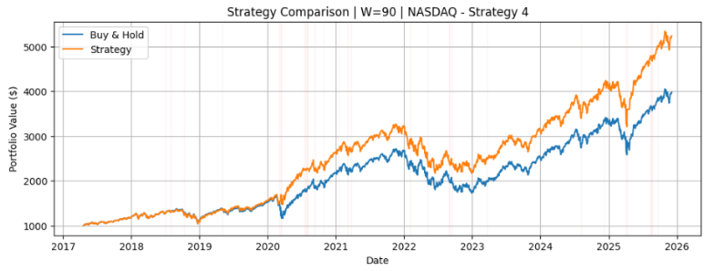
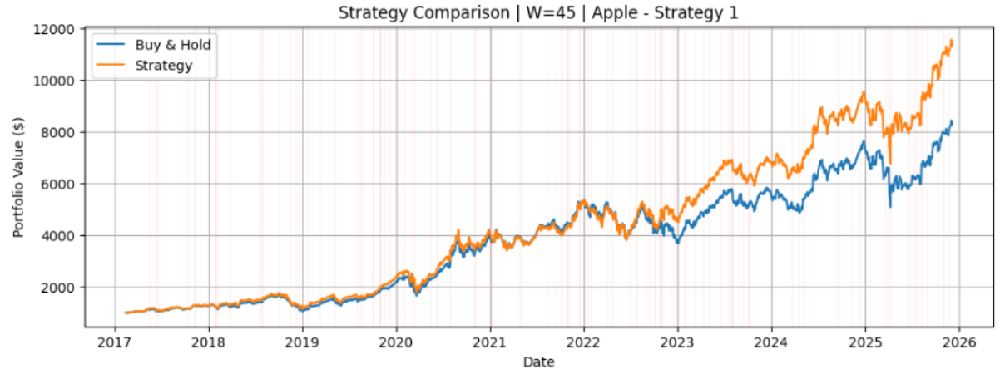
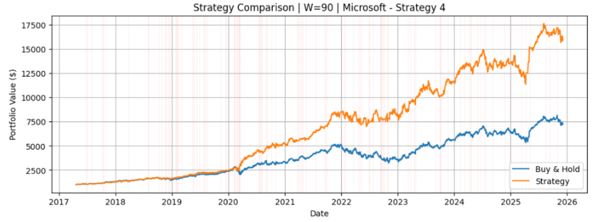
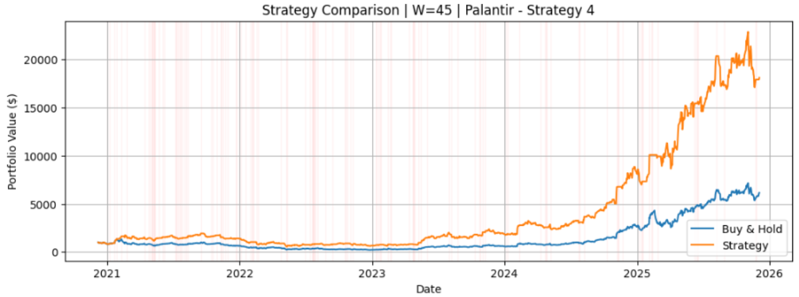
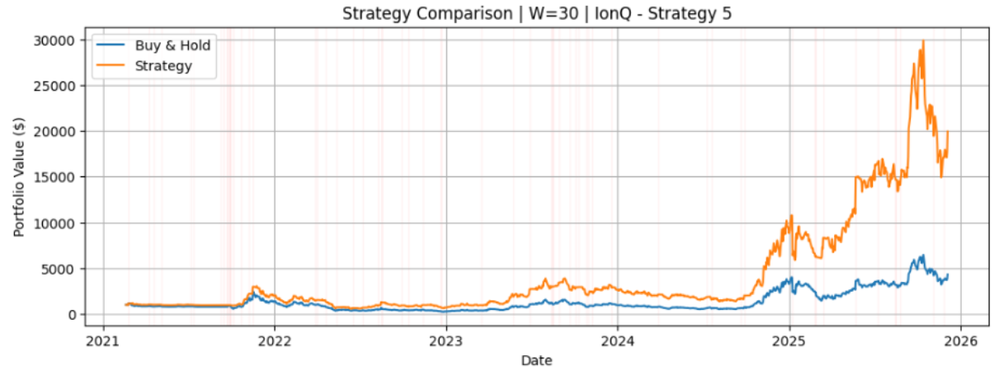

# Persistent Homology–Driven Trading Strategies Under Financial Market Anomalies

## Note
This project was completed as the final course project for the POSTECH Mathematical Data Science class during the Fall 2025 semester.

## Overview

This project uses **persistent homology (PH)** to detect structural regime changes in financial time series and translates those signals into rule-based trading strategies. The pipeline converts daily closing prices into topological features via sliding-window embeddings and Vietoris–Rips filtrations, then applies a One-Class SVM to flag anomaly periods. Five increasingly adaptive strategies are evaluated against a buy-and-hold baseline over ~10 years of U.S. market data.

## Project Structure

```
ph-trading-strategies/
├── main.py               # CLI entry point
├── requirements.txt
├── src/
│   ├── __init__.py       # Public API re-exports
│   ├── core.py           # PH computation & SVM anomaly detection
│   ├── strategies.py     # Trading strategies S1–S5 + grid search
│   ├── visualization.py  # Plotting (anomaly diagnostics & performance)
│   └── evaluation.py     # Strategy runner, comparison table, best picker
├── data/                 # Place CSV files here
└── figures/              # (optional) saved plots
```

## Installation

```bash
pip install -r requirements.txt
```

## Usage

```bash
# List available assets
python main.py --list-assets

# Run a single asset × window size
python main.py --asset snp500 --window 45
python main.py --asset ionq -w 30

# Sweep all window sizes for an asset
python main.py --asset msft --all-windows

# Custom data directory
python main.py --asset aapl -w 45 --data-dir ./my_data
```

**What happens when you run it:**
1. Computes PH features and detects anomalies
2. Plots landscape distances, SVM scores, and price chart with anomalies
3. Runs all 5 strategies (S1–S5, with grid search for S5)
4. Prints a comparison table and plots the best strategy

### As a Python library

```python
from src import (
    compute_features_for_window, strategy_bh, strategy4,
    run_strategy, plot_strategy,
)
import pandas as pd

df = pd.read_csv("data/snp500.csv")
df["Date"] = pd.to_datetime(df["Date"])
df["Price"] = df["Price"].astype(str).str.replace(",", "").str.strip().astype(float)
df = df.sort_values("Date").reset_index(drop=True)

result = compute_features_for_window(df, W=45)
df_s4 = run_strategy(result, strategy_bh, strategy4)
plot_strategy(df_s4, W=45, asset_name="S&P 500")
```

## Strategies

| # | Name | Description |
|---|------|-------------|
| S0 | Buy & Hold | Passive baseline — full exposure throughout |
| S1 | Full Exit | Exit entirely on any anomaly; re-enter when normal |
| S2 | Directional Exit | Exit on positive anomaly only; re-enter on negative |
| S3 | Delayed Re-Entry | Like S2, but requires a fixed cool-down before re-entry |
| S4 | Adaptive Re-Entry | Cool-down length adapts to rolling volatility ratio |
| S5 | Partial Scaling | Partial buy/sell fractions with adaptive cool-down |

## Data

Daily closing prices from [Investing.com](https://www.investing.com/). Each CSV needs `Date` and `Price` columns.

**Expected filenames:** `snp500.csv`, `nasdaq.csv`, `aapl.csv`, `msft.csv`, `ionq.csv`, `pltr.csv`

## Key Results

| Asset | Best W | Best Strategy | vs Buy & Hold |
|-------|--------|---------------|---------------|
| S&P 500 | 45 | S4 | +21.15% |
| NASDAQ | 90 | S4 | +31.75% |
| AAPL | 45 | S1 | +36.94% |
| MSFT | 90 | S3 | +113.35% |
| IONQ | 30 | S5 | +362.89% |
| PLTR | 45 | S4 | +194.53% |

## Figures (Best Strategy per Asset)

<p float="left">
  
  
</p>

<p float="left">
  
  
</p>

<p float="left">
  
  
</p>

## Hyperparameters

| Parameter | Values |
|-----------|--------|
| Window size W | {15, 30, 45, 60, 75, 90} |
| Embedding dim / delay / step | 3 / 2 / 1 |
| SVM ν | 0.05 |
| S5 buy/sell fractions | grid search over [0.1, 0.9] |

## References

1. Edelsbrunner et al., "Topological Persistence and Simplification," IEEE, 2000.
2. Gidea et al., "Topological Data Analysis of Financial Time Series: Landscapes of Crashes," arXiv:1703.04385, 2017.
3. Gidea et al., "Topological Signatures in US Indices and Sector ETFs," J. Math. Finance, 2020.
4. Bois et al., "A Persistent Homology-Based Algorithm for Unsupervised Time-Series Anomaly Detection," TMLR, 2024.
5. Heo et al., "Persistent Homology of Featured Time Series Data and Its Applications," AIMS Mathematics, 2024.
